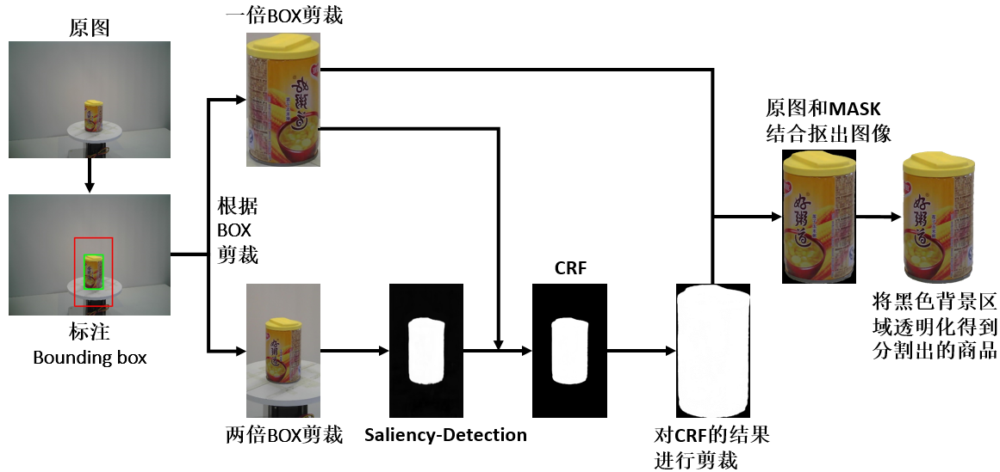

# 复现实验
记录实验过程：思路，实现方法，问题，解决/为解决。

四个基线实验中，第一个实验直接使用单个商品图像数据来训练，这个在数据集中直接有，而第四个实验是基于2，3实验来完成的，所以要处理的是实验2，3中所需数据的获取。

首先第一步要从单个商品图像中将商品目标分割出来，下图是一个实现流程草图：

大致可分为以下几步：

1. 利用所给信息对单个商品图像进行bounding box的标注并以此进行剪裁（当然实际操作可以直接剪裁），分别剪裁出一倍和两倍bounding box大小的图像。